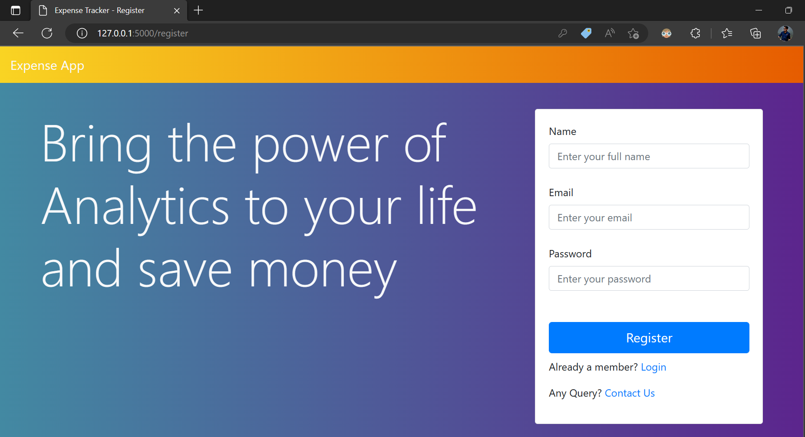

<p align="center">
    
    <h1 align="center">Flask Expense Tracker WebApp</h1>
 
</p>

<p align="center">
    <a href="https://expensestrackerapp-ysma7ol4bq-em.a.run.app/">View Demo</a>
    ·
    <a href="https://github.com/santos-k/Flask_Expense_App/issues/new/choose">Report Bug</a>
    ·
    <a href="https://github.com/anuraghazra/Flask_Expense_App/issues/new/choose">Request Feature</a>
    ·
    <a href="https://github.com/anuraghazra/Flask_Expense_App/discussions">Ask Question</a>
  </p>

<p align="center">
  <a href="https://www.python.org/downloads/release/python-310/"></a>
</p>

<p align="center">
    
    
    
    
</p>

## Overview
Introducing Expense Tracker, a powerful expense tracking web application built on Flask. This comprehensive tool is designed
to assist users in effectively managing their financial transactions, including earnings, expenses, investments, and savings.
With Expense App, users can easily record, track and categorize their expenses, providing them with valuable insights into their spending habits. 
Additionally, the application features advanced analysis and visualization tools, which allow users to gain a deeper understanding of 
their financial data and make more informed financial decisions. 
Whether you're a professional or an individual, Expense Tracker is the perfect solution for managing your finances 
and reaching your financial goals.

## Prerequisites
To fully utilize the features and capabilities of Expense App, users must have the following prerequisites installed on their system:

1. Python 3.6 or higher
2. Flask web framework
3. Plotly for data visualization
4. Pandas for data manipulation
5. Basic understanding of HTML, CSS, and JavaScript for designing the front-end interface.

With these tools and technologies, users will be able to run the application and access its 
powerful expense tracking, analysis and visualization features. It also allows the user to customize the front-end interface as per the requirement. 


## Project File Structure
    ```
    myproject/
        main.py
        support.py
        requirements.txt
        templates/
            login.html
            register.html
            home.html
            analysis.html
            profile.html
            contact.html
        static/
            css/
                style.css
            js/
                script.js
    ```

## Installation
1. Clone the repository: `git clone https://github.com/santos-k/Flask_Expense_App`
2. Install the required packages: `pip install -r requirements.txt`
3. Run the application: `python main.py`

## Features
- User-friendly login and registration system that ensures secure access to the application. Users can log in with their correct credentials or register for a new account.
- A comprehensive home page that provides an overview of the user's records, statistics, and data visualization tools to help the user understand their expenses, and add new records.
- A powerful analysis page that provides a deep understanding of the user's data through interactive and advanced charts, which help the user to understand their expense patterns.
- A user-friendly profile page that allows users to manage their personal information such as name, email, and password.
- A contact page that provides various ways for users to reach the support team and submit queries or feedback related to the application.
- Advanced session management system that terminates the user's session after 5 minutes of inactivity for security reasons.

Please note that the user's session will terminate after 5 minutes of inactivity to ensure security, and user will be prompted with a message before session termination so that he can save any unsaved data.
For any query or feedback, you can always reach us via phone, email or address, provided on the contact page.


## Usage
### 1. Login Page functionalities
The login page for Expense Tracker app will have the following functionalities:
  - Login
    * Users will be able to login to the web application using their correct credentials.
    * Upon successful login, the user will be redirected to the home page of their account.
    * The Home page cannot be accessed without logging in or by other users.
    * In case of incorrect credentials being entered, an alert message will be displayed to inform the user of the error.
    * Users will have the option to reset their password by clicking on the "Forgot Password" link.
    * Users who are not yet registered will have the option to navigate to the registration page.
    * A contact page will also be accessible from the login page, allowing users to reach out with any questions or issues they may have.

  

    
### 2. Forget Password
* The "Forgot Password" functionality of Expense App allows users to reset their existing account password in case they have forgotten it.
* Users can initiate a password reset by clicking on the "Forgot Password" link on the login page and providing their registered email address and new password. 
* If the email address exists in the database,the password will reset successfully, 
* the user will be redirected to the login page where they can enter their new password and access their account.
* If the email address provided does not exist in the database, an alert message will be displayed to inform the user that the email address is not registered.
* Users can also redirect to the registration page and login page.
* This feature is aimed to provide a secure and easy way for the users to reset their password. 

Note: Resetting password does not authenticate user at this point so anyone can change password of any account if the know email address 


 

The login page will be the gatekeeper to the webapp and responsible for securing the app by allowing access only to authorized users. With the inclusion of these features, the login page will provide a convenient, secure, and user-friendly experience for all users.

### 3. Registration Page Functionality
- To register a new user, navigate to the register page by clicking on the "Register" link on the login page.
- Provide basic details like name, email, and password, and click on the "Register" button.
- If the email provided does not exist in the database, the user will be registered and redirected to the home page.
- If the email provided already exists in the database, an alert message will be displayed to inform the user that the email address is already registered.
- Users can navigate to the login page or contact page from the register page, if they have any questions or issues.
- The register page cannot be accessed once a user is logged in during the same session.
- To register again, the user needs to log out first or open the application in a new browser window or in an incognito window.
- This feature allows new users to create an account, also prevent duplicate registration with the same email.
The registration page ensures that only unique users can create an account and prevents unauthorized access. It also provides an easy and simple way for new users to register for the application.





### 4. Home Page 
- Provides an overview of the user's records, including statistics, table records, graph, and visual charts.
- Gives deep insights into the user's expenses, allowing them to better understand their spending habits.
- Allows users to add new records for their expenses, incomes, savings, and investments.
- User can see their spending, earning and saving records in easy to understand format.
- Provides a clear and concise view of the user's financial status.
- Allows users to interact with the data and perform advanced analysis using the built-in visualization tools.
- User also able to get the facts and trends of the records and able to set budget and track the same.
- Users can edit, delete the records that they already entered.
The home page serves as the primary interface for users to manage and analyze their financial data. 
It provides a convenient and user-friendly way to access all the information and functionalities needed to effectively 
track and manage their finances. The user-friendly interface and built-in visualization tools make it easy to understand 
the insights and make informed financial decisions.


### 5. Analysis Page
- Allows users to gain a deeper understanding of their financial data through interactive, advanced charts.
- Provide insights into spending patterns, trends, and habits.
- Users can see their expenses by category, month, and year, with the help of interactive pie charts, bar graphs and line graphs.
- Provides a clear view of where the user's money is going and make smart financial decisions.
- Helps users identify patterns and trends in their expenses over time.
- Allows user to compare their spending with their earning and saving to see how they are managing their money over time.
- User can download the graph in image formats.

The analysis page serves as a powerful tool for users to analyze and understand their financial data in a user-friendly and interactive way. 
It enables users to interact with their data and make informed financial decisions based on their understanding of their spending patterns 
and trends. The intuitive interface, advanced visualization tools, easy for users to access and understand the insights in their financial data.


### 6. Profile Page
- Allows users to manage their personal information such as name and email.
- User can update their name, email address, and password.
- If the user wants to change their email, the new email id must be unique and not already registered in the system.
- Users can view and update their personal information at any time.
- The profile page is only accessible to the logged-in user.


### 7. Contact Page
- Allows users to submit queries or feedback related to the application.
- Provides various ways to reach us such as phone, email, and physical address.
- User can submit their query or feedback by filling the form on the contact page.
- Form includes fields for name, email, phone and message, user can fill the form with the details.
- Once the user has submitted the query or feedback, they will be redirected to either the home page or login page depending on whether they are logged in or not.
- User can also reach us by clicking on the phone number, email and address, that will redirect to phone dialer, email client and map respectively.
- The contact page is accessible to all users.

The contact page is designed to provide users with a convenient and user-friendly way to reach the support team of Expense App. It provides various options to reach the support team, so that users can submit their queries or feedback and receive assistance in the most convenient way. The user can also reach us via phone, email and address, so that they can contact us easily. The contact page is a valuable resource for users who need help or want to provide feedback, and it helps ensure that users have a positive experience with the app.


## Session Termination
- The user's session will terminate after 5 minutes of inactivity.
- This is a security measure to prevent unauthorized access to the user's account.
- After the session termination, the user will need to log in again to access the application.
- This feature can help to prevent leaving the browser window open and forget to logout.
- It also helps to maintain the security and prevent session hijack.
- This feature can be configured as per the requirement, the time of inactivity can be adjusted if needed.
- The user will be prompted with a message before session termination.
- This feature ensures that the user's session is protected and the user's data remains secure.

This functionality ensures that the user's session is protected and the user's data remains secure. 
It helps to maintain the security of the application by terminating the session after a period of inactivity. 
This can also help to reduce the risk of session hijacking and ensures that only authorized users have access to the sensitive information. 
The time of inactivity can be configured as per the requirement, but the default settings is 5 minutes. 
The user also will be prompted with a message before session termination so that he can save any unsaved data.

## Deployment on Google Cloud(GCP)
- Follow the step by step deployment [process](https://github.com/santos-k/Notes/blob/main/Deploy_Portfolio_on_GCP.md)


## Contributing
We welcome contributions to Expense App! If you would like to contribute.

## License
Expense App is open-sourced under the MIT license.

## Conclusion
Expense App is a powerful and user-friendly expense tracking application that helps users to effectively manage their financial transactions and reach their financial goals. The application provides a comprehensive and easy-to-use interface that allows users to record, track, and analyze their expenses. With advanced data visualization and analysis tools, users can gain a deeper understanding of their financial data and make informed financial decisions. The application also features a secure login and registration system, a user-friendly profile management system, and a convenient contact page for support and feedback. By utilizing the features and capabilities of Expense App, users can take control of their finances and achieve financial success.
